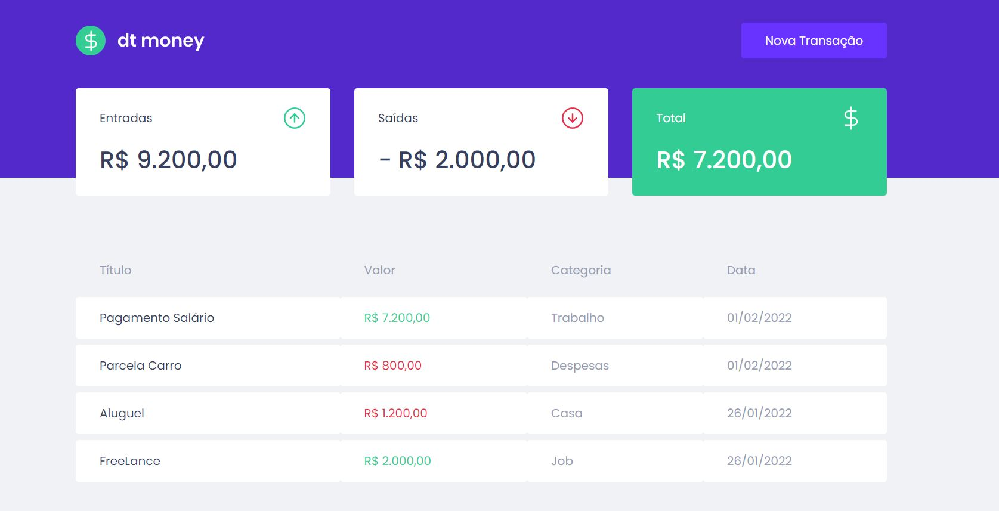
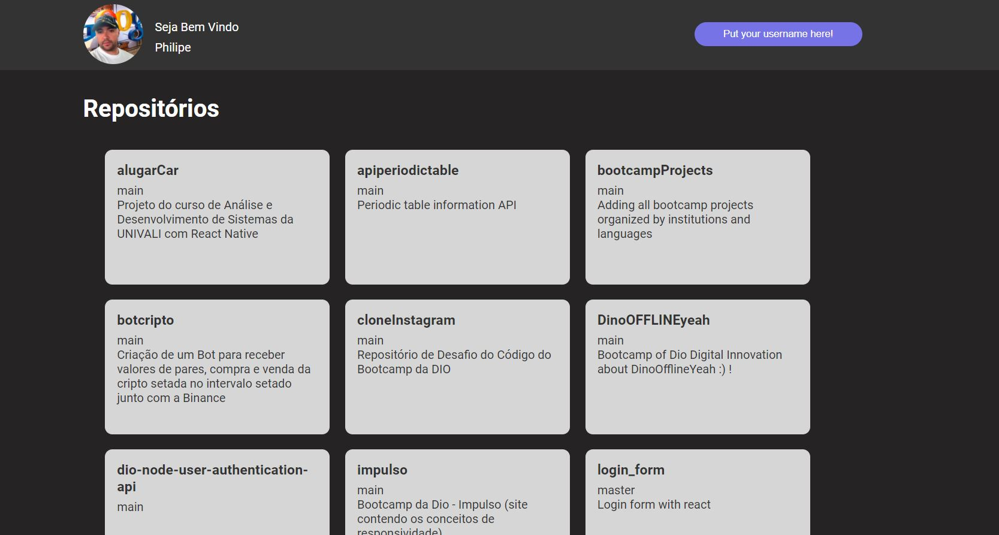
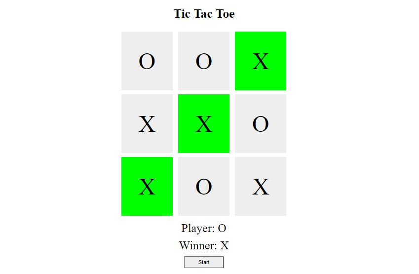

# Introduction of access to projects

## How to access

This repository includes all bootcamps made in one place.
The idea behind is simple. Just organize the projects by institutions and technologies in a simple way.
Everything that is currently being studied is here. Just access the institution and then the technology.
The readme files for each will be updated over the course of days. It was a mistake I made and I'm ready to correct it.

## Favorite Projects

At the moment there are four projects that stand out from the others.
Are they: 
ReactJs: 
  * rocketseat/react/dtmoney
  * diome/react/listrepositoriesgithub { In the process of switching to the CONTEXT API! }
<table border="1">
    <thead>
    	<tr>
        	<th>dtMoney</th>
          <th>listRepositoriesGithub</th>
        </tr>
    </thead>
    <tbody>
    	<tr>
        	<td align="center"></td>
            <td align="center"></td>
        </tr>
    </tbody>
</table>

Javascript:
 * diome/javascript/spaceshooter
 * diome/javascript/tictactoe

<table border="1">
    <thead>
    	<tr>
        	<th>SpaceShooter</th>
          <th>TicTacToe</th>
        </tr>
    </thead>
    <tbody>
    	<tr>
        	<td align="center"></td>
            <td align="center"></td>
        </tr>
    </tbody>
</table>

