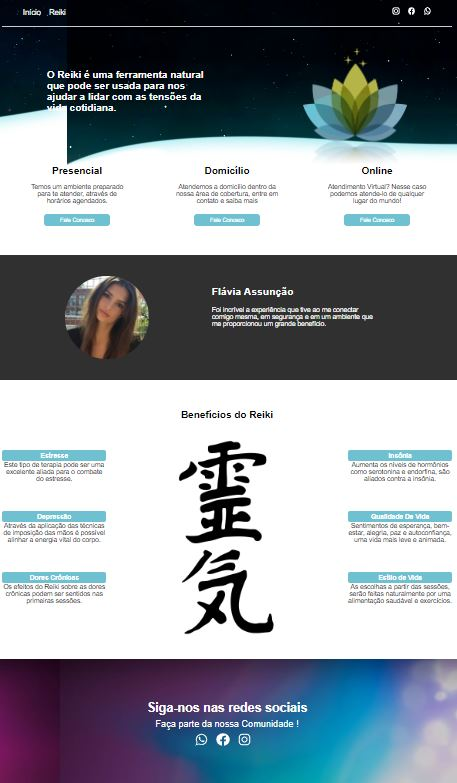
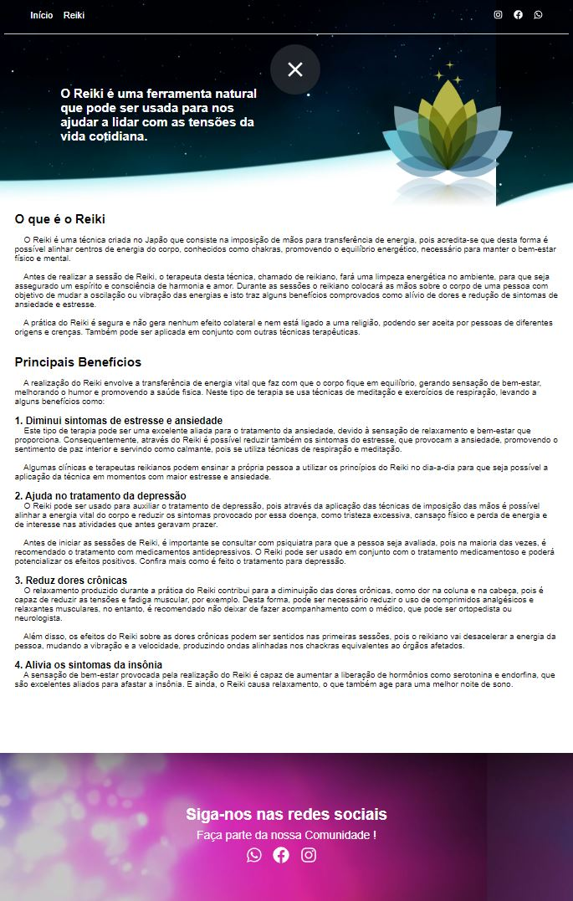

# Projeto Reiki

 
  
  
  
  

 

## Como acessar

Uma página simples e responsiva com reactJS afim de ajudar na propagação das informações do nicho do cliente.
Neste caso o mesmo possuí habilidades com o Reiki. A priori foi criado um banner com as informações das novas redes sociais do cliente e nele um QRCode que envia os usuários de seu estabelecimento a uma página de árvore de links, onde lá é direcionado as redes do mesmo e por fim ao site criado em ReactJs.
O site pode ser visualizado no link abaixo enquanto o cliente decide o local de hospedagem.
<a href="https://reiki-psi.vercel.app/">Site do Cliente | Reiki</a>

## 

At the moment there are four projects that stand out from the others.
Are they: 
ReactJs: 
  * rocketseat/react/dtmoney
  * diome/react/listrepositoriesgithub { In the process of switching to the CONTEXT API! }
<table border="1">
    <thead>
    	<tr>
      <th>Home</th>
      <th></th>
     </tr>
    </thead>
    <tbody>
    	<tr>
      <td align="center">Reiki</td>
      <td align="center"></td>
     </tr>
    </tbody>
</table>
